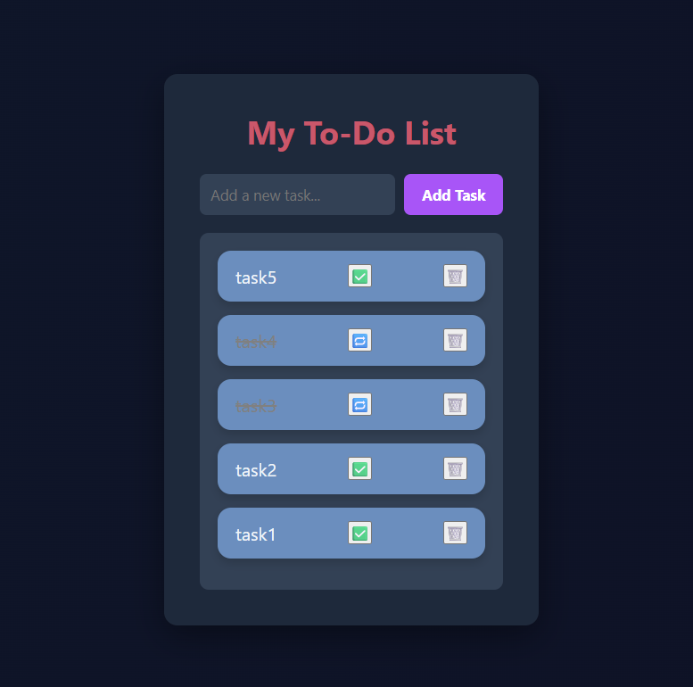

# 📝 ToDoList

A simple and interactive ToDo List web application built using **HTML**, **CSS**, and **JavaScript**. This project demonstrates how to store and manage tasks using the **Web Storage API**, including both `localStorage` and `sessionStorage`.

---

## 🚀 Features

- ✅ Add new tasks
- ❌ Delete existing tasks
- 🔁 Mark tasks as complete/incomplete
- 💾 Store tasks in `localStorage` for long-term persistence
- 🧠 Store tasks in `sessionStorage` for session-based tasks
- 📱 Responsive and clean user interface

---

## 📸 Screenshots



---

## 🛠️ Technologies Used

```bash
- **HTML5** – Markup structure
- **CSS3** – Styling and layout
- **JavaScript** – Functionality and DOM manipulation
- **Web Storage**:
  - `localStorage` – Keeps tasks even after the browser is closed
  - `sessionStorage` – Keeps tasks only during the current session

```

## 📂 Project Structure

```bash
ToDoList/
│
├── index.html # Main HTML file
├── style.css # CSS for layout and styling
├── script.js # JavaScript logic
└── README.md # Project documentation
```

### [🚀 View Live Demo](https://8f37jf.csb.app/)
